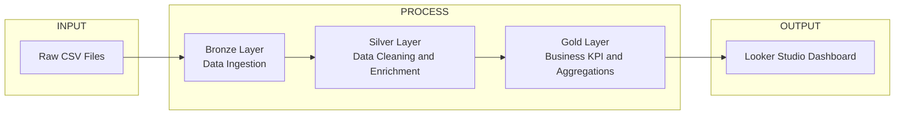
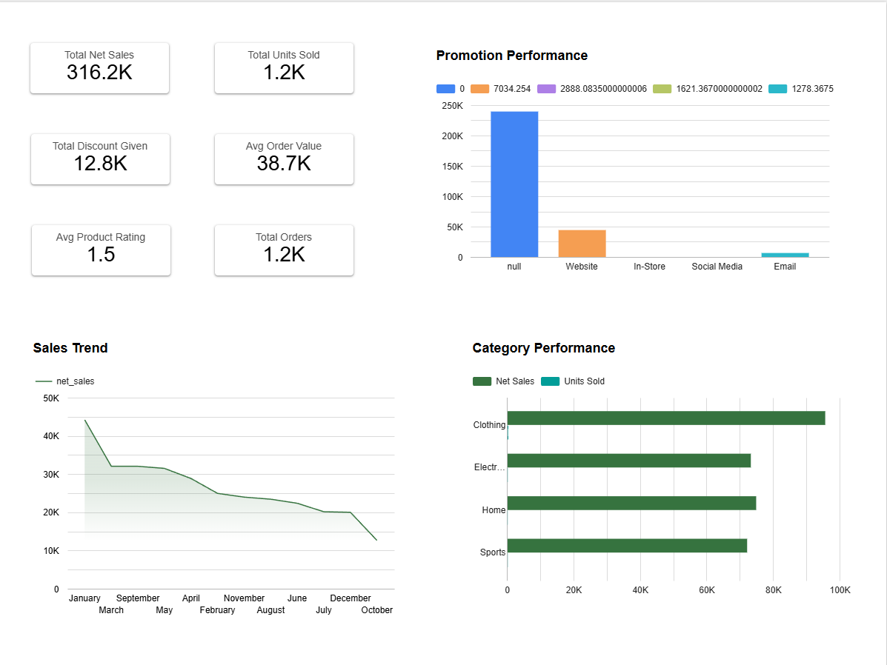
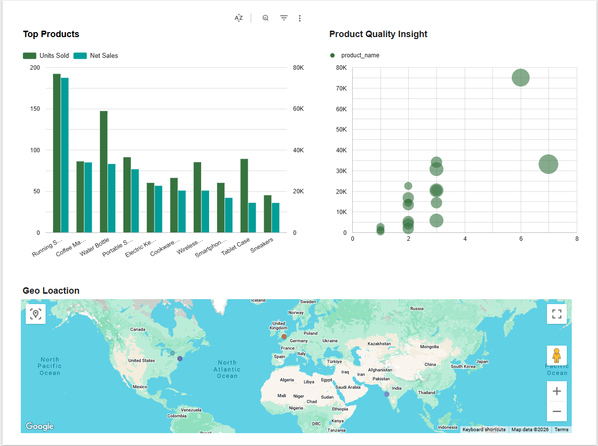
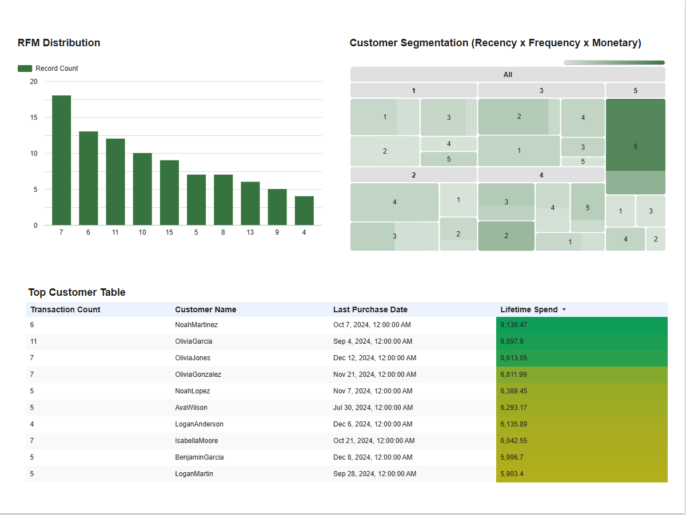

## Retail Performance & Customer Analytics Dashboard

# Project Overview
This project demonstrates the design and implementation of an end-to-end data analytics pipeline using the **Medallion Architecture (Bronze → Silver → Gold)** in Databricks, followed by the development of a KPI-driven business intelligence dashboard in **Looker Studio**.

The objective was to transform raw retail transaction data into a clean, analytics-ready model and generate business insights across:

- Sales performance
- Product analytics
- Promotion impact
- Customer segmentation (RFM analysis)

The final dashboard is powered exclusively from curated Gold layer tables.

---
## Key Skills Demonstrated
- Medallion architecture design (Bronze/Silver/Gold)
- Data cleaning & transformation using PySpark
- Business KPI modeling
- Revenue & AOV calculations
- Promotion impact analysis
- Product rating vs revenue correlation
- RFM customer segmentation
- Data modeling for analytics consumption
- Dashboard storytelling & executive reporting

---
## I/O Architecture Diagram

**Pipeline flow:**
1. Create Schema dand upload the Raw CSV Files  (Raw).
2. Ingests data into **Bronze Schema** (streaming + checkpointing).
3. **Silver** cleans and enriches data (dates, hour, weekday, high-value flag).
4. **Gold** builds business KPIs (daily/hourly/category/top accounts/high-value table).
5. Created dashboard using **Looker Studio**

---
## Repo Structure
```text
ecommerce/
├── Code Files/
│   ├── Book 01 - Bronze Ingestion & Schema Validation
│   ├── Book 02 - Silver Cleaning & Normalization
│   ├── Book 03 - Gold Business KPIs , Aggregations
│   └── Book 04 - BigQuery Intergration
├── Looker Studio/
│   ├── Retail_Performance_&_Customer_Analytics_Dashboard_Built_on_Databricks_Gold_Layer.pdf
├── images/
│   ├── customer_analysis(RFM).png
│   ├── executive_overview.png
│   └── product_&_store_performance.png
└── README.md
```

---
## Data Layers(Medallion)
**Bronze(Data Ingestion)**
- Ingested raw CSV data into Delta tables
- Preserved original schema structure
- Stored data in structured database schemas
- No business transformations applied
- Enabled reproducible raw data storage

**Silver(Clean + Enrich)**
- Data type standardization
- Null handling & cleansing
- Derived metrics (net sales, discount handling)
- Joined transaction, product, customer, and promotion datasets
- Created analytics-ready enriched transaction table

**Gold(KPI Aggregations)**
The Gold layer was designed specifically for BI and reporting.
- gold.daily_store_category
- gold.product_impact
- gold.promo_impact
- gold.rfm
- gold.top_customers
- gold.suspects

## Data Modeling (Looker Studio)
The Gold layer follows a business-centric modeling approach:
- Fact-style aggregated tables for reporting
- Pre-calculated KPIs (Net Sales, Units Sold, AOV)
- Promotion impact aggregation
- Product performance metrics
- RFM scoring for customer segmentation
The model prioritizes:
- Performance
- Simplicity for BI tools
- Clear business definitions

---
## Dashboard (Power BI)
## Executive Overview
- Total Net Sales
- Total Units Sold
- Total Discount Given
- Average Order Value
- Sales Trend (Time Series)
- Category Performance
- Promotion Performance

## Product and Store Performance
- Top Performing Products
- Revenue vs Units Comparison
- Product Rating vs Revenue Scatter Analysis
- Geographic Sales Distribution

## Customer Analysis(Recency x Frequency x Monetary)
- RFM Score Distribution
- Customer Segmentation Grid
- Top Customer Table with Conditional Formatting


---
## What This Project Demonstrates
- End-to-end data pipeline design
- Analytical thinking beyond simple aggregation
- Business KPI modeling
- Customer behavior segmentation
- Dashboard storytelling for decision-makers
- Practical cloud data engineering & analytics integration

---
## Future Improvements
- Automated BigQuery publishing workflow
- Scheduled orchestration using Databricks Workflows
- Advanced cohort analysis
- Profitability-level analysis
- Customer churn prediction modeling
